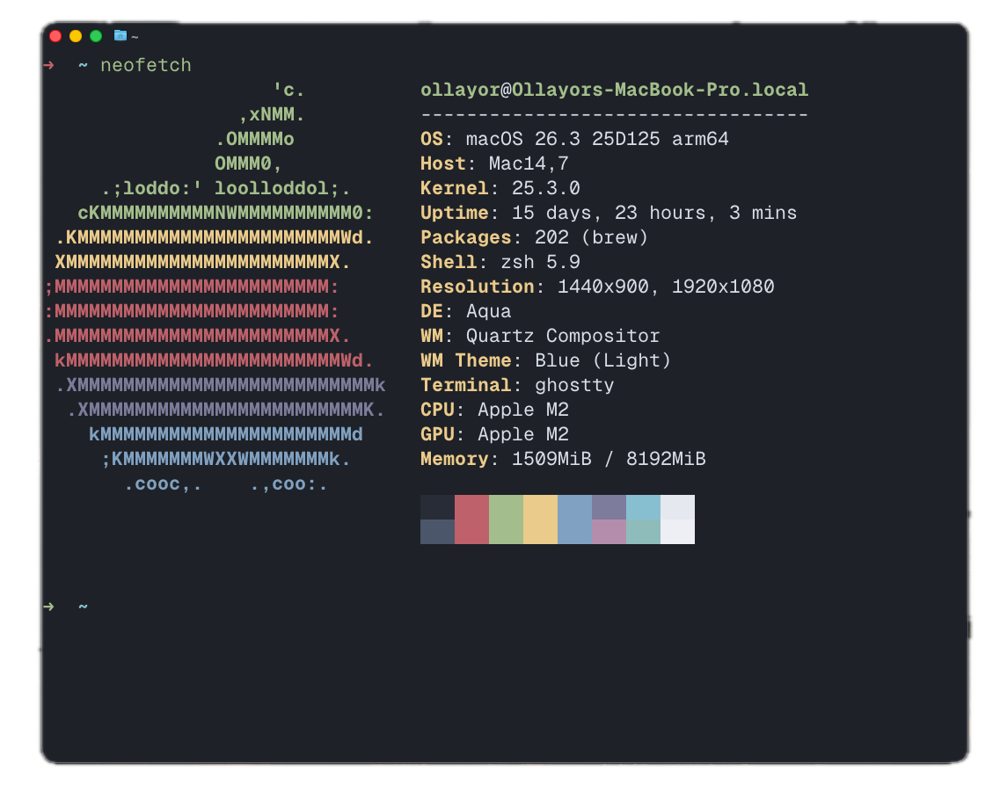

# Midnight Theme for Ghostty

A sleek and focused **Ghostty** terminal theme inspired by the **Midnight** VSCode/Cursor theme. It features a **deep dark background** with a **cool Nordic palette** for a calm, distraction-free coding environment.

## 🎨 Theme Preview

> **Colors inspired by Midnight's syntax highlighting:**
> - **Background:** `#1e2127`
> - **Foreground:** `#d8dee9`
> - **Accent Colors:** Cyan (`#88c0d0`), Teal (`#8fbcbb`), Blue (`#81a1c1`)



## 📥 Installation

1. **Download the theme**:
   ```sh
   git clone https://github.com/olllayor/midnight.git
   cd midnight/themes
   ```

2. **Move the theme to Ghostty's theme directory**:
   ```sh
   mkdir -p ~/.config/ghostty/themes
   cp nord-dark.conf ~/.config/ghostty/themes/Midnight.conf
   ```

3. **Set the theme in Ghostty**:
   Open `~/.config/ghostty/config` and add:
   ```ini
   theme = Midnight
   ```

4. **Restart Ghostty** to apply the theme.

## 🎨 Color Palette

| Color Name        | Hex Code    | Usage                    |
|-------------------|-------------|--------------------------|
| **Background**    | `#1e2127`   | Terminal BG              |
| **Foreground**    | `#d8dee9`   | Main Text                |
| **Cursor**        | `#d8dee9`   | Cursor                   |
| **Selection**     | `#434c5e`   | Selection BG             |
| **Black**         | `#272c36`   | ANSI Black               |
| **Red**           | `#bf616a`   | Errors, Deletions        |
| **Green**         | `#a3be8c`   | Strings, Insertions      |
| **Yellow**        | `#ebcb8b`   | Warnings, Constants      |
| **Blue**          | `#81a1c1`   | Keywords, Tags           |
| **Magenta**       | `#7d7c9b`   | Special Tokens           |
| **Cyan**          | `#88c0d0`   | Functions, Links         |
| **White**         | `#e5e9f0`   | Default Text             |
| **Bright Black**  | `#4c566a`   | Comments, Muted Text     |
| **Bright Magenta**| `#b48ead`   | Numbers, Booleans        |
| **Bright Cyan**   | `#8fbcbb`   | Types, Classes           |
| **Bright White**  | `#eceff4`   | Emphasized Text          |

## 🛠️ Customization

Feel free to tweak the color scheme inside `Midnight.conf` to match your preferences. The theme is also available for **Zed** and **VS Code / Cursor** — check the repo for all variants.

## 📝 License

This theme is licensed under the [MIT License](LICENSE).

## 💙 Credits

- Terminal adaptation for **[Ghostty](https://ghostty.org/)** by **[Olloyor](https://github.com/olllayor)**
- Also available for **[Zed](https://zed.dev/)** and **[Cursor](https://cursor.sh/)**

Enjoy using Midnight! 🌙
